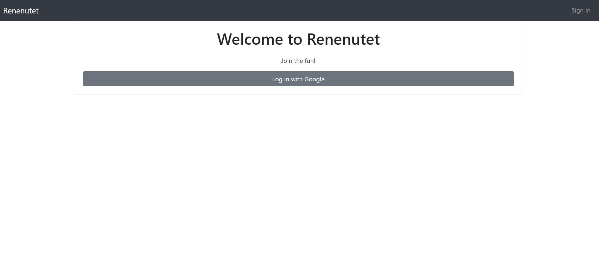

# Renenutet

## Purpose
I have always had an affinity for personal weath building. There are many components and methods for building weath, and one of them is through business ownership. The simplest way to invest in a business is through stock ownership. This app utilizes the [IEX API](https://iextrading.com/developer/docs/) to get stock information from American exchanges and display the various stock info to users. 

## To View

**Note: This project requires you to have your own Google Firebase Account**

1. Clone repository to local machine. [Github Walkthrough](https://help.github.com/articles/cloning-a-repository/)
1. With Node.js, run the following command in your termial to download webpage dependencies: ```npm install```
1. Open `src/helpers/firebase/fbKeys.js.example`
    * In [Firebase](https://console.firebase.google.com/), create a project
    * Select the 'webpage' app 
    * Match each key in the config variable to the keys available in `fbKeys.js.example`
    * Input the value of each key
    * Rename the file `fbKeys.js`
1. You will need to create a realtime database in Firebase and start in test mode 
1. Import the `./planning/front-cap.json` file into the database for seed data.   Under the "supported-symbol" key, import the corresponding json file
1. Under the "Rules" tab in the database module, you'll see ```"rules": {
    ".read": true,
    ".write": true }```
    
    Add the following key: value pair to the rules. ```"active-collection": {
      ".indexOn": "uid"
    },
    "watching": {
      ".indexOn": "uid"
    }``` This allows the database to process specific data that is integral for the app's functionality.


1. run the following command in your terminal to initiate the app: ```npm start```
This should automatically open a new tab in your default browser and run the web app, which pulls data from the Firebase app you have created.


* Alternitavely, You can visit [here](https://finance-app-b48a1.firebaseapp.com/)

## Notes

This project lacks extensive styling. Simple Bootstrap classes as well as a few standard css properties are used to make the page barley viewable. 

There are many limitations to this app. In its current state. It can only search for stocks by their ticker/symbol, there isn't a robust way to compare metrics, and many more. I hope whoever uses this finds some value in it.
